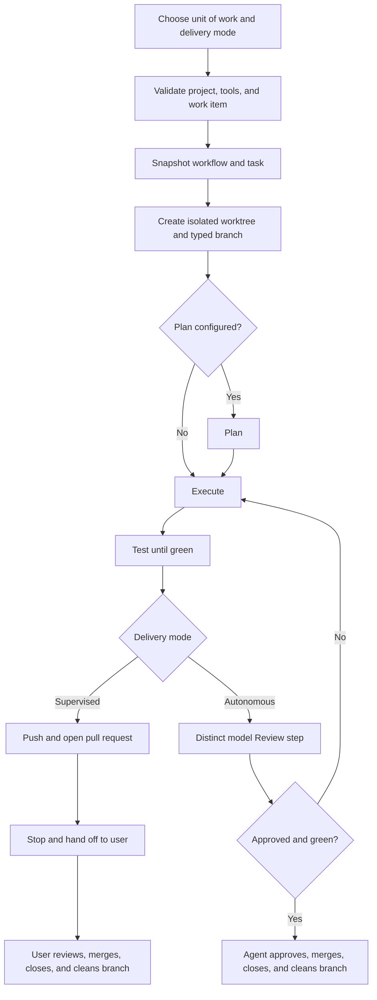

# Development Workflow Document — Maestro

## 1. Purpose

This document formalizes the approved [operational workflow](../initial/Workflow.md) for moving one selected
unit of work through a Maestro run to pull-request delivery. A unit of work may be a documented use case, a
GitHub issue, or a free-form task.

> **One unit of work = one workflow run = one branch = one GitHub issue when issue tracking applies = one pull
> request.**

Testing practice is defined in the
[Testing Specification Document](Testing%20Specification%20Document.md); technologies and versions are defined
in the [Technology Stack Document](Technology%20Stack%20Document.md).

## 2. Workflow at a Glance



No intermediate user approval is required in either mode. Supervised mode pauses only after pull-request
creation; autonomous mode completes every valid stage unattended.

## 3. Work Item and Issue Lifecycle

| Work-item approach | Tracking behavior |
| --- | --- |
| Documented use case | The use-case identifier is captured; a GitHub issue may track it when one exists. |
| GitHub issue | The issue is mandatory and is linked to branch, commits, run, and pull request. |
| Free-form task | The immutable task text is captured; no issue is required. |

When a GitHub project status is configured, a tracked issue follows **Todo → In Progress → Testing → Done**.
The issue moves to In Progress after branch creation, Testing when implementation is code-complete, and Done
only after merge. Review changes continue on the same branch and return through the test gate.

## 4. Step-by-Step Process

### Step 1 — Load and Validate the Source

Read the selected use case, issue, or free-form task and current repository instructions. Validate the
project, clean Git state, workflow, unit-of-work reference, installed CLIs, models, and GitHub access. A dirty
source worktree blocks start until the user commits or explicitly discards its changes.

### Step 2 — Materialize and Snapshot the Workflow

Use a reusable workflow or create a one-off workflow. Execute is mandatory; a new workflow defaults to Plan,
Execute, and Review. Capture an immutable snapshot of the work item, delivery mode, ordered steps, assignments,
configuration, and project reference.

### Step 3 — Create the Isolated Branch

Create an isolated Git worktree in Maestro's application-data area from an up-to-date main branch. Use the
prefix matching the work type:

```text
feature/<descriptive-slug>
fix/<descriptive-slug>
refactor/<descriptive-slug>
hotfix/<descriptive-slug>
```

If a GitHub issue and project status apply, move the issue to In Progress.

### Step 4 — Plan When Configured

The assigned Plan agent converts the source material into a repository-specific design and testable sequence.
Its declared output becomes context for Execute. If no Plan step exists, Execute receives the original
snapshotted work item and repository context.

### Step 5 — Execute

The assigned Execute agent implements the requested main and alternative flows on the isolated branch. It
commits code and tests, streams output, and records outcomes. Every configured custom step executes in its
snapshotted order.

### Step 6 — Test Until Green

When issue status applies, move the issue to Testing. Following the
[Testing Specification Document](Testing%20Specification%20Document.md):

1. Cover the main flow and every applicable alternative flow.
2. Run `flutter test` and applicable platform integration suites.
3. Fix implementation or test failures.
4. Rerun affected and full required suites until green.

No pull request may be opened as ready for delivery while required tests fail.

### Step 7 — Review and Deliver

- **Supervised:** agents may push and open the pull request, then Maestro stops. The user alone reviews,
  approves, merges, closes the work item, and deletes the branch.
- **Autonomous:** a distinct configured Review model inspects the change and evidence. Requested changes return
  to Execute and Testing. Only an approving review plus green tests permits agent approval, merge, work-item
  closure, and branch cleanup.

### Step 8 — Record Completion

Persist the final issue, branch, test, review, pull-request, and merge evidence. Mark a tracked issue Done only
after merge. Clean the isolated worktree after the applicable mode completes its required branch lifecycle.

## 5. Run-Control Rules During Delivery

- A pause request lets the active step finish and pauses before the next step.
- Resume starts the next pending step.
- Cancel immediately terminates the run's complete process tree.
- Retry asks the user to resume the affected step from preserved context, rerun that step from scratch, or
  restart the complete workflow.
- Every retry creates a new attempt without modifying the snapshot or earlier evidence.

## 6. Definition of Done

- [ ] The selected unit of work and delivery mode are retained in an immutable snapshot.
- [ ] Work used an isolated branch with the correct `feature/`, `fix/`, `refactor/`, or `hotfix/` prefix.
- [ ] Main flow and applicable alternative flows are implemented.
- [ ] Required tests cover the work and all required suites pass.
- [ ] A traceable pull request exists.
- [ ] Supervised delivery was handed to and merged by the user, or autonomous delivery received distinct model
      approval before agent merge.
- [ ] Applicable issue status and closure are correct.
- [ ] The branch and isolated worktree were cleaned by the actor authorized for the selected mode.
- [ ] Final execution and delivery evidence is available in history.

## 7. References

- [Use Case Specification Document](Use%20Case%20Specification%20Document.md)
- [System Requirements Document](System%20Requirements%20Document.md)
- [Testing Specification Document](Testing%20Specification%20Document.md)
- [Technology Stack Document](Technology%20Stack%20Document.md)
- [Workflow](../initial/Workflow.md)
