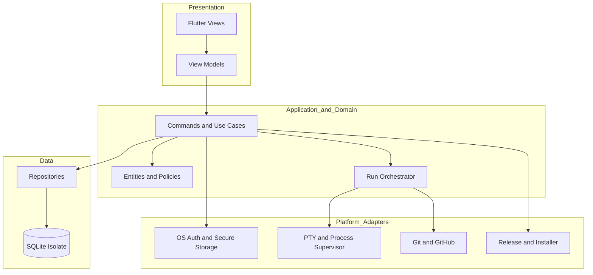

# Operations & Infrastructure Document — Maestro

## 1. Introduction

### 1.1 Purpose

This document captures Maestro's technical foundation, configuration, local operations, diagnostics,
environments, build, packaging, releases, and updates. Technologies and versions are defined only in the
[Technology Stack Document](Technology%20Stack%20Document.md).

### 1.2 Scope

- Feature-first solution structure and dependency boundaries.
- Local database, secure storage, process, worktree, and log foundations.
- Configuration, redaction, audit, retention, compaction, and health diagnostics.
- Development, CI, release, and installed environments.
- Windows and Linux build, packaging, publication, signing, and updates.

---

## 2. Technical Foundation

### 2.1 Overview

Maestro is one native desktop process with layered Dart modules. A composition root wires feature view models
to application commands, domain policies, repositories, and replaceable platform adapters. Blocking database
work and process streams are isolated from UI rendering. Every workflow run owns an application-data worktree,
process supervisor, output pipeline, and durable attempt record.

### 2.2 Solution Architecture



### 2.3 Repository Layout

```text
maestro/
  lib/
    app/
    core/{errors,logging,security,storage}/
    features/<feature>/{presentation,application,domain,data}/
    platform/{auth,git,github,process,terminal,updates}/
  test/
  integration_test/
  test_support/
  windows/
  linux/
  tooling/{packaging,release}/
  .github/workflows/
  docs/{initial,requirements}/
```

### 2.4 Platform Requirements

| ID | Requirement |
| --- | --- |
| IR-01 | The solution shall enforce inward dependency flow from platform and data implementations toward application and domain interfaces. |
| IR-02 | The solution shall initialize SQLite in a background isolate and run verified schema migrations before protected features open. |
| IR-03 | The solution shall store database, logs, updates, and isolated worktrees under the per-user application-data directory. |
| IR-04 | The solution shall create one independently supervised process context per active run. |
| IR-05 | The solution shall use Windows job objects and Unix process groups to support whole-tree cancellation. |
| IR-06 | The solution shall clean stale isolated worktrees only after reconciling them with durable run state. |
| IR-07 | The solution shall preserve project source folders during cleanup and data deletion. |
| IR-08 | The solution shall provide typed adapters for Git, GitHub, each AI CLI, authentication, PTY, and updates. |
| IR-09 | The solution shall run unit, widget, integration, migration, and supported-platform suites in CI. |
| IR-10 | The solution shall build Windows artifacts on Windows and Linux artifacts on Linux. |
| IR-11 | The solution shall publish checksummed, signed release manifests and artifacts to GitHub Releases. |
| IR-12 | The solution shall produce a portable Windows archive and an installable Windows package. |
| IR-13 | The solution shall produce an AppImage and an installable Debian-family package validated on Ubuntu LTS. |
| IR-14 | The solution shall retain the dependency lockfile and toolchain selection used for every release build. |
| IR-15 | The solution shall support automatic update checks and user-approved installation for each published installation type. |

---

## 3. Configuration

| Concern | Mechanism | Notes |
| --- | --- | --- |
| User preferences | SQLite settings | Theme, update interval, retention age, storage limit, compaction age, and UI behavior. |
| Default retention values | Release configuration | Selected and documented from soak-test evidence before the first release; user-editable afterward. |
| Local credentials and keys | Operating-system protected storage | Password verifiers, update trust key material, and any future external token references. |
| Project and workflow configuration | SQLite | Non-secret metadata and settings. |
| CLI environment | Explicit allowlisted environment plus inherited required platform values | Secrets are never copied into logs or snapshots. |
| CI and release values | GitHub Actions secrets and variables | Signing keys, repository coordinates, and publishing controls. |
| Build identity | Project manifest and CI | Version, commit, platform, architecture, and channel embedded in artifacts. |

Invalid configuration is rejected while the last valid value remains active. Defaults are versioned and
migrated without overwriting user customization.

---

## 4. Logging and Monitoring

| Concern | Approach |
| --- | --- |
| Application logs | Structured local events with timestamp, severity, category, correlation ID, and redacted context. |
| Run logs | Ordered binary-safe segments associated with run, step, attempt, and stream. |
| Audit trail | Append-oriented local records for authentication, deletion, run control, and autonomous delivery. |
| Destinations | SQLite for durable records and rotating diagnostic files for startup/platform failures. |
| Live display | Bounded stream buffers with batching and backpressure. |
| Retention | User-configurable age and storage-size policy with documented release defaults. |
| Compaction | Lossless compression verified before the original segment is replaced; expansion on demand. |
| Never logged | Passwords, password verifiers, tokens, private keys, complete secret-bearing environments, or unredacted credential responses. |

Maintenance emits audit and diagnostic outcomes. If persistence falls behind, Maestro protects responsiveness
with bounded buffers and surfaces degraded durability rather than consuming unbounded memory.

---

## 5. Health Diagnostics

Maestro has no network health endpoint. It performs non-blocking startup and on-demand diagnostics visible to
the authenticated user.

| Check | Healthy result | Failure behavior |
| --- | --- | --- |
| Database and migrations | Database opens and integrity/migration checks pass | Protected data features remain closed with recovery guidance. |
| Application-data paths | Required directories are writable with sufficient usable space | New runs and updates are blocked; existing readable history remains available. |
| Git | Executable is available and project status can be read | Git-dependent actions are blocked per project. |
| GitHub | Required repository operation is authenticated and reachable | Local work remains available; remote delivery/update actions report degraded status. |
| AI CLIs | Required executables and sessions are available | Affected workflow steps are blocked with remediation guidance. |
| Shell and PTY | Platform shell starts in a harmless probe session | Embedded terminal and CLI runs are blocked if interactive execution is unsafe. |
| Update trust | Release manifest signature can be verified against trusted key material | Installation is disabled and the event is audited. |

---

## 6. Environments

| Environment | Purpose | Differences |
| --- | --- | --- |
| Local development | Interactive implementation and fast tests | Debug diagnostics, disposable data, fake integrations by default. |
| Continuous integration | Deterministic verification | Ephemeral data, fake external services, target-platform contract and integration jobs. |
| Release validation | Artifact acceptance | Signed candidate artifacts, clean virtual machines, installation, update, rollback, and smoke tests. |
| Installed production | User operation | Per-user durable data, release logging defaults, verified updates, no development credentials. |

There is no server staging environment. External smoke tests use isolated repositories and credentials rather
than a user's projects.

---

## 7. Build and Delivery

The GitHub Actions pipeline performs:

1. Dependency resolution and lockfile verification.
2. Static analysis, formatting verification, and unit/widget tests.
3. Migration, contract, concurrent-run, and target-platform integration tests.
4. Native Windows and Linux release builds on their matching runners.
5. Portable archive, installable package, AppImage, and Debian-family package creation.
6. Clean-machine install, launch, update, and data-preservation smoke tests.
7. Checksums, signed release manifest, provenance metadata, and artifact signing.
8. GitHub Release publication only after all required jobs pass.

Maestro checks the signed manifest on a configurable schedule and manual request. It downloads only the
matching platform, architecture, and installation type; verifies signature and checksum; asks the user; then
invokes the platform-specific installer. Failure must preserve the current usable installation and user data
where platform capabilities permit rollback.

---

## 8. Traceability

| Platform capability | Requirements |
| --- | --- |
| Layered technical foundation | IR-01 through IR-08 |
| Verification and reproducibility | IR-09 through IR-11, IR-14 |
| Windows distribution | IR-10, IR-12, IR-15 |
| Linux distribution | IR-10, IR-13, IR-15 |
