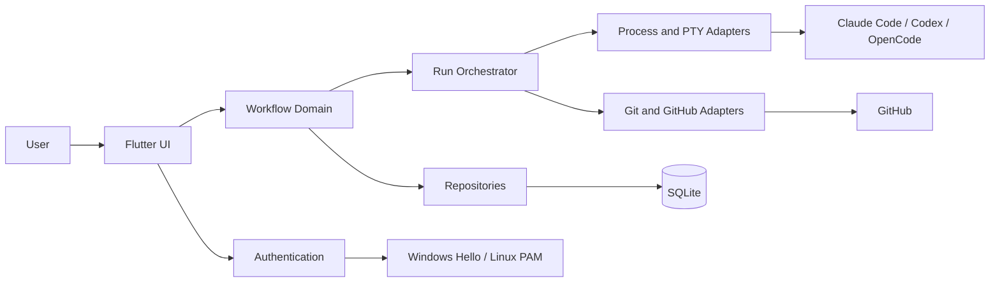
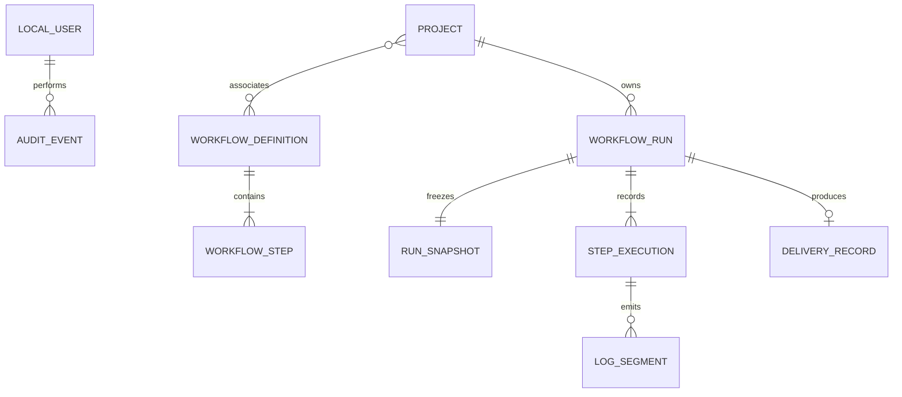
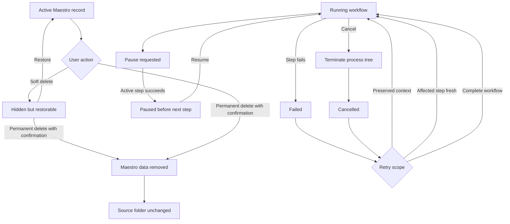

# System Requirements Document — Maestro

## 1. Introduction

### 1.1 Purpose

This document specifies the functional and non-functional requirements for **Maestro**. The concrete platform,
libraries, database, and tooling are defined in the
[Technology Stack Document](Technology%20Stack%20Document.md).

### 1.2 Scope

The system covers authentication, project references, workflow and agent configuration, isolated concurrent
execution, observation, recovery, embedded terminals, GitHub delivery, history, audit, retention, and updates.

### 1.3 Definitions

| Term | Definition |
| --- | --- |
| **Active step** | The currently executing step of a run. |
| **Attempt** | One execution of a snapshotted step or retry scope. |
| **Dirty worktree** | A Git working tree containing staged, unstaged, or untracked changes. |
| **Lossless compaction** | Compression that can reproduce the original log bytes. |
| **Process tree** | A CLI or shell process started by Maestro and every descendant it creates. |
| **Run worktree** | An isolated Git worktree created in Maestro's application-data area for one run. |

---

## 2. System Overview

---

## 3. Functional Requirements

### 3.1 Authentication (`AU`)

| ID | Requirement |
| --- | --- |
| FR-AU-01 | The system shall authenticate a local user through the operating system's supported credential mechanism. |
| FR-AU-02 | The system shall permit creation of a local email-and-password account with a normalized unique email address. |
| FR-AU-03 | The system shall require a local password containing at least eight characters. |
| FR-AU-04 | The system shall display guidance recommending a strong password during account creation and password change. |
| FR-AU-05 | The system shall store only a salted password verifier in protected storage and shall never persist plaintext passwords. |
| FR-AU-06 | The system shall deny protected functions until authentication succeeds. |
| FR-AU-07 | The system shall grant every authenticated local user full application permissions. |

### 3.2 Project Management (`PR`)

| ID | Requirement |
| --- | --- |
| FR-PR-01 | The system shall register an existing local folder only when it is a Git working tree. |
| FR-PR-02 | The system shall require a project name that is unique across non-permanently-deleted records. |
| FR-PR-03 | The system shall display active registered projects in a left-side panel. |
| FR-PR-04 | The system shall validate that a registered folder remains accessible before project operations. |
| FR-PR-05 | The system shall store project metadata and a folder reference without copying or owning source contents. |
| FR-PR-06 | The system shall leave every source file and folder unchanged when a project record is soft-deleted or permanently deleted. |
| FR-PR-07 | The system shall prevent a run from starting while its project worktree is dirty and shall ask the user to commit or explicitly discard the changes. |

### 3.3 Workflow Design (`WF`)

| ID | Requirement |
| --- | --- |
| FR-WF-01 | The system shall require every workflow to contain exactly one Execute step. |
| FR-WF-02 | The system shall create new workflows with ordered Plan, Execute, and Review steps by default. |
| FR-WF-03 | The system shall permit ordered custom steps in addition to the standard step kinds. |
| FR-WF-04 | The system shall create reusable workflows that may be associated with multiple projects. |
| FR-WF-05 | The system shall create one-off workflows for a single task. |
| FR-WF-06 | The system shall assign a globally unique stable identifier to every workflow. |
| FR-WF-07 | The system shall validate step ordering and mandatory fields before saving or running a workflow. |
| FR-WF-08 | The system shall select use case, GitHub issue, or free-form task as the workflow's unit-of-work approach. |

### 3.4 Agent Configuration (`AG`)

| ID | Requirement |
| --- | --- |
| FR-AG-01 | The system shall assign exactly one AI CLI and one model to every workflow step. |
| FR-AG-02 | The system shall support Claude Code as a step executor. |
| FR-AG-03 | The system shall support OpenAI Codex as a step executor. |
| FR-AG-04 | The system shall support OpenCode as a step executor. |
| FR-AG-05 | The system shall permit the same CLI and model assignment on multiple workflow steps. |
| FR-AG-06 | The system shall use each CLI's existing local installation and authenticated session. |
| FR-AG-07 | The system shall report a missing, inaccessible, or unauthenticated CLI before its step begins. |

### 3.5 Workflow Execution (`EX`)

| ID | Requirement |
| --- | --- |
| FR-EX-01 | The system shall resolve and validate the selected work item before a run starts. |
| FR-EX-02 | The system shall capture an immutable snapshot of the workflow, task, delivery mode, project, and step configuration when a run starts. |
| FR-EX-03 | The system shall create a typed Git branch using the approved branch-prefix rules. |
| FR-EX-04 | The system shall create an isolated run worktree in Maestro's application-data area. |
| FR-EX-05 | The system shall execute snapshotted steps in their defined order. |
| FR-EX-06 | The system shall pass the prior step's declared output context to the next step. |
| FR-EX-07 | The system shall support at least two simultaneous runs while preserving run isolation. |
| FR-EX-08 | The system shall keep workflow execution independent of edits subsequently made to its source workflow. |
| FR-EX-09 | The system shall record each step's start time, completion time, exit status, and outcome. |

### 3.6 Live Observation (`OB`)

| ID | Requirement |
| --- | --- |
| FR-OB-01 | The system shall show a visual representation of every active run and its ordered steps. |
| FR-OB-02 | The system shall identify the current step and status of each active run. |
| FR-OB-03 | The system shall stream step output to the run view as close to real time as practical. |
| FR-OB-04 | The system shall apply bounded buffering and backpressure so log rendering does not impair UI or execution performance. |
| FR-OB-05 | The system shall distinguish standard output, errors, lifecycle events, and diagnostic messages when their source provides that distinction. |
| FR-OB-06 | The system shall preserve streamed logs in run history. |

### 3.7 Run Control and Recovery (`RC`)

| ID | Requirement |
| --- | --- |
| FR-RC-01 | The system shall accept a pause request while a run is active. |
| FR-RC-02 | The system shall finish the active step and pause before starting the next step. |
| FR-RC-03 | The system shall resume a paused run at its next pending step. |
| FR-RC-04 | The system shall immediately terminate the complete process tree when a run is cancelled. |
| FR-RC-05 | The system shall offer retry from preserved context at the affected step. |
| FR-RC-06 | The system shall offer rerunning the affected step from scratch. |
| FR-RC-07 | The system shall offer restarting the complete workflow. |
| FR-RC-08 | The system shall record each recovery operation as a new attempt without changing prior evidence or the run snapshot. |

### 3.8 Embedded Terminal (`TE`)

| ID | Requirement |
| --- | --- |
| FR-TE-01 | The system shall embed an interactive terminal within the project workspace view. |
| FR-TE-02 | The system shall open PowerShell on Windows and Bash on Linux. |
| FR-TE-03 | The system shall start the terminal with the registered project folder as its working directory. |
| FR-TE-04 | The system shall support interactive input, ANSI output, resize, selection, copy, and paste. |
| FR-TE-05 | The system shall close the terminal process tree when its session is explicitly terminated. |

### 3.9 Governed Delivery (`DE`)

| ID | Requirement |
| --- | --- |
| FR-DE-01 | The system shall default new workflows to supervised delivery mode. |
| FR-DE-02 | The system shall permit supervised agents to commit, test, push, and open a pull request without intermediate approval. |
| FR-DE-03 | The system shall stop a supervised run after opening the pull request and hand it to the user. |
| FR-DE-04 | The system shall prevent an agent from approving, merging, closing, or deleting the branch of a supervised run. |
| FR-DE-05 | The system shall permit autonomous agents to push and open a pull request without user intervention. |
| FR-DE-06 | The system shall require a distinct model Review step before autonomous approval or merge. |
| FR-DE-07 | The system shall prevent autonomous merge while required tests fail. |
| FR-DE-08 | The system shall prevent autonomous merge when model review requests changes. |
| FR-DE-09 | The system shall permit autonomous approval and merge after tests pass and model review approves. |
| FR-DE-10 | The system shall close the applicable GitHub issue and clean up the branch after autonomous merge. |
| FR-DE-11 | The system shall preserve pull-request identifiers, URLs, review outcome, merge result, and commit reference in run history. |

### 3.10 History and Data Lifecycle (`HI`)

| ID | Requirement |
| --- | --- |
| FR-HI-01 | The system shall provide searchable history for completed, failed, cancelled, and paused runs. |
| FR-HI-02 | The system shall display the immutable snapshot, attempts, logs, and delivery evidence for a selected run. |
| FR-HI-03 | The system shall record authentication, deletion, run-control, and autonomous-delivery actions in a local audit trail. |
| FR-HI-04 | The system shall provide configurable default retention age and storage-size limits. |
| FR-HI-05 | The system shall losslessly compact eligible log segments after the configured age. |
| FR-HI-06 | The system shall expand a compacted log segment on demand without losing original content. |
| FR-HI-07 | The system shall support soft deletion and restoration of project records, workflows, and run history. |
| FR-HI-08 | The system shall support explicit permanent deletion of Maestro-managed records after confirmation. |
| FR-HI-09 | The system shall preserve referenced source folders during every Maestro data-lifecycle operation. |

### 3.11 Application Updates (`UP`)

| ID | Requirement |
| --- | --- |
| FR-UP-01 | The system shall check GitHub Releases for an applicable update at a configurable interval and on manual request. |
| FR-UP-02 | The system shall perform update checks without blocking the UI. |
| FR-UP-03 | The system shall display the available version, release notes, artifact type, and download size before installation. |
| FR-UP-04 | The system shall verify the downloaded artifact against the signed release manifest before installation. |
| FR-UP-05 | The system shall refuse an artifact whose signature, checksum, platform, or architecture does not match. |
| FR-UP-06 | The system shall obtain explicit user approval before installing an update. |
| FR-UP-07 | The system shall preserve user data and report an actionable result after installation succeeds or fails. |

---

## 4. Data Model

### 4.0 Identifier Strategy

Persisted domain entities use UUIDv7 as their stable identifier across UI, logs, and integrations. SQLite may
use private integer row IDs and foreign-key indexes as storage optimizations; those values never escape the
data layer. GitHub identifiers and file paths remain external references rather than Maestro entity IDs.

### 4.1 Entity Relationship Diagram

### 4.2 Local User Fields

| Field | Type | Constraints | Description |
| --- | --- | --- | --- |
| id | UUIDv7 | Required, unique | Stable local identity. |
| email | String? | Normalized, unique when present | Email/password login name. |
| auth_method | Enum | Required | Operating-system or email/password. |
| verifier_key | String? | Protected-storage reference | Password verifier lookup; never plaintext. |
| created_at | Timestamp | Required | Account creation time. |
| last_authenticated_at | Timestamp? | Optional | Last successful authentication. |

### 4.3 Project Fields

| Field | Type | Constraints | Description |
| --- | --- | --- | --- |
| id | UUIDv7 | Required, unique | Stable project record identity. |
| name | String | Required, unique until permanent deletion | User-facing name. |
| folder_path | String | Required | Non-owned absolute Git folder reference. |
| created_at / updated_at | Timestamp | Required | Record timestamps. |
| deleted_at | Timestamp? | Optional | Soft-deletion marker. |

### 4.4 Workflow Definition and Step Fields

| Entity.Field | Type | Constraints | Description |
| --- | --- | --- | --- |
| workflow.id | UUIDv7 | Required, unique | Stable workflow identity. |
| workflow.name | String? | Required for reusable workflow | Display name. |
| workflow.reusable | Boolean | Required | Reusable versus one-off. |
| workflow.unit_type | Enum | Required | Use case, issue, or free-form. |
| workflow.delivery_mode | Enum | Required, defaults supervised | Governance policy. |
| workflow.deleted_at | Timestamp? | Optional | Soft-deletion marker. |
| step.id | UUIDv7 | Required, unique | Stable step identity. |
| step.workflow_id | UUIDv7 | Required, foreign key | Owning workflow. |
| step.position | Integer | Required, unique per workflow, non-negative | Execution order. |
| step.kind / name | Enum / String | Required | Standard kind and display name. |
| step.cli / model | Enum / String | Required | Executor assignment. |
| step.configuration | JSON | Required, defaults empty object | CLI-specific non-secret settings. |

### 4.5 Workflow Run and Snapshot Fields

| Entity.Field | Type | Constraints | Description |
| --- | --- | --- | --- |
| run.id | UUIDv7 | Required, unique | Stable run identity. |
| run.project_id | UUIDv7 | Required, foreign key | Selected project. |
| run.workflow_id | UUIDv7? | Optional foreign key | Source workflow when retained. |
| run.status | Enum | Required | Queued, running, pause-requested, paused, succeeded, failed, or cancelled. |
| run.current_position | Integer? | Optional | Current or next step position. |
| run.worktree_path | String | Required while retained | Isolated application-data worktree. |
| run.started_at / completed_at | Timestamp | Start required; completion optional | Lifecycle timing. |
| run.deleted_at | Timestamp? | Optional | Soft-deletion marker. |
| snapshot.run_id | UUIDv7 | Required, unique foreign key | Exactly one snapshot per run. |
| snapshot.schema / payload | Integer / JSON | Required | Immutable serialized workflow and task. |
| snapshot.created_at | Timestamp | Required | Capture time. |

### 4.6 Execution, Log, Delivery, Audit, and Setting Fields

| Entity.Field | Type | Constraints | Description |
| --- | --- | --- | --- |
| execution.id | UUIDv7 | Required, unique | Attempt identity. |
| execution.run_id / step_id | UUIDv7 | Required | Run and snapshotted-step references. |
| execution.attempt / status | Integer / Enum | Required | Attempt number and lifecycle state. |
| execution.started_at / completed_at | Timestamp | Start required; completion optional | Timing. |
| execution.exit_code / failure_code | Integer? / String? | Optional | Process result or typed failure. |
| log.id / execution_id | UUIDv7 | Required | Segment and attempt references. |
| log.sequence / stream | Integer / Enum | Required | Stable order and source category. |
| log.payload / compression | Blob / Enum | Required | Original or losslessly compressed bytes. |
| log.created_at / compacted_at | Timestamp | Creation required; compaction optional | Lifecycle timing. |
| delivery.run_id | UUIDv7 | Required, unique | Run reference. |
| delivery.issue / pull_request / url | String? | Optional | GitHub references. |
| delivery.review / merge_commit | Enum / String? | Optional | Review and merge evidence. |
| audit.id / actor_id | UUIDv7 | Required | Audit identity and user. |
| audit.action / target / outcome | String | Required | Structured event data. |
| audit.occurred_at / details | Timestamp / JSON | Required | Time and redacted context. |
| setting.key / value / type | String / JSON / Enum | Required, key unique | User-configurable ordinary setting. |

---

## 5. Desktop Interaction Surface

| Surface | Operations | Requirements |
| --- | --- | --- |
| Authentication | Sign in, create local account, sign out | FR-AU-01 through FR-AU-07 |
| Project panel | Register, select, validate, soft-delete, restore, permanently remove | FR-PR-01 through FR-PR-07 |
| Workflow editor | Create, edit, validate, reuse, create one-off | FR-WF-01 through FR-AG-07 |
| Run workspace | Start, inspect, pause, resume, cancel, retry | FR-EX-01 through FR-RC-08 |
| Terminal | Open, interact, resize, close | FR-TE-01 through FR-TE-05 |
| Delivery view | Inspect issue, branch, pull request, review, and merge evidence | FR-DE-01 through FR-DE-11 |
| History and settings | Search, inspect, retain, compact, delete, audit | FR-HI-01 through FR-HI-09 |
| Updates | Check, inspect, approve, install | FR-UP-01 through FR-UP-07 |

---

## 6. Non-Functional Requirements

| ID | Category | Requirement |
| --- | --- | --- |
| NFR-01 | Responsiveness | The system shall keep navigation and run-control interactions responsive while at least two runs stream output. |
| NFR-02 | Performance | The system shall batch and backpressure log rendering when necessary to protect UI and execution throughput. |
| NFR-03 | Efficiency | The system shall use bounded in-memory log buffers and move durable history to persistent storage. |
| NFR-04 | Reliability | The system shall recover a consistent database state after application or process failure. |
| NFR-05 | Reliability | The system shall not report cancellation complete until known run-related processes have terminated or a termination failure is reported. |
| NFR-06 | Security | The system shall redact passwords, tokens, credential material, and environment secrets from application and audit logs. |
| NFR-07 | Security | The system shall verify update authenticity and integrity before execution. |
| NFR-08 | Maintainability | The system shall isolate UI, domain, persistence, and platform integrations behind testable interfaces. |
| NFR-09 | Portability | The system shall pass its supported-platform integration suite on Windows and Ubuntu LTS release artifacts. |
| NFR-10 | Auditability | The system shall preserve ordered, timestamped evidence for security-sensitive and autonomous actions until its configured lifecycle removes it. |
| NFR-11 | Accessibility | The system shall expose semantic labels and keyboard navigation for primary workflow and run-control operations. |
| NFR-12 | Usability | The system shall provide actionable recovery guidance for every typed failure surfaced to the user. |

No server availability SLA or fixed resource ceiling applies to the local desktop application. Performance is
evaluated through responsiveness, concurrency, bounded-memory, and non-blocking behavior rather than an
invented hardware-specific threshold.

---

## 7. Authorization Matrix

| Operation | Unauthenticated person | Authenticated local user | Supervised agent | Autonomous agent |
| --- | --- | --- | --- | --- |
| Authenticate or bootstrap account | ✅ | ✅ | ❌ | ❌ |
| Manage Maestro records and settings | ❌ | ✅ | ❌ | ❌ |
| Start and control a run | ❌ | ✅ | ⚠️ only within assigned step | ⚠️ only within assigned run |
| Modify project source for authorized work | ❌ | ✅ | ✅ | ✅ |
| Open pull request | ❌ | ✅ | ✅ | ✅ |
| Approve or merge pull request | ❌ | ✅ | ❌ | ⚠️ after green tests and independent approval |
| Delete source project folder | ❌ | ❌ | ❌ | ❌ |

Legend: ✅ allowed · ⚠️ allowed under the stated condition · ❌ denied.

---

## 8. Lifecycle Strategy

Permanent deletion removes only Maestro-managed records. Run snapshots and prior attempts remain immutable
until their owning history is permanently deleted. Compaction is lossless and reversible.

---

## 9. Traceability

| Feature | Requirements |
| --- | --- |
| F-01 Local authentication | FR-AU-01 through FR-AU-07 |
| F-02 Project management | FR-PR-01 through FR-PR-07 |
| F-03 Workflow design | FR-WF-01 through FR-WF-08 |
| F-04 Agent configuration | FR-AG-01 through FR-AG-07 |
| F-05 Concurrent execution | FR-EX-01 through FR-EX-09 |
| F-06 Live observation | FR-OB-01 through FR-OB-06 |
| F-07 Run control and recovery | FR-RC-01 through FR-RC-08 |
| F-08 Embedded terminal | FR-TE-01 through FR-TE-05 |
| F-09 Governed delivery | FR-DE-01 through FR-DE-11 |
| F-10 History and data lifecycle | FR-HI-01 through FR-HI-09 |
| F-11 Application updates | FR-UP-01 through FR-UP-07 |

| Business Rule | Realized by |
| --- | --- |
| BR-01 | FR-WF-01 |
| BR-02 | FR-WF-02 |
| BR-03 | FR-AG-01 |
| BR-04 | FR-AG-02, FR-AG-03, FR-AG-04 |
| BR-05 | FR-AG-05 |
| BR-06 | FR-WF-08, FR-EX-01 |
| BR-07 | FR-EX-02, FR-EX-08 |
| BR-08 | FR-EX-07 |
| BR-09 | FR-DE-01 |
| BR-10 | FR-DE-02, FR-DE-03, FR-DE-04 |
| BR-11 | FR-DE-05, FR-DE-09, FR-DE-10 |
| BR-12 | FR-DE-06, FR-DE-07, FR-DE-08, FR-DE-09 |
| BR-13 | FR-OB-01, FR-OB-02, FR-OB-03, FR-OB-06 |
| BR-14 | FR-RC-01, FR-RC-02, FR-RC-03 |
| BR-15 | FR-RC-04 |
| BR-16 | FR-RC-05, FR-RC-06, FR-RC-07 |
| BR-17 | FR-RC-08 |
| BR-18 | FR-PR-01, FR-PR-05 |
| BR-19 | FR-PR-06, FR-HI-09 |
| BR-20 | FR-HI-07, FR-HI-08 |
| BR-21 | FR-AU-07 |
| BR-22 | FR-AG-06 |
