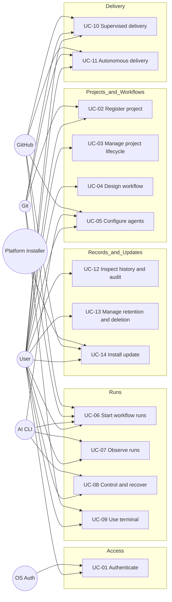
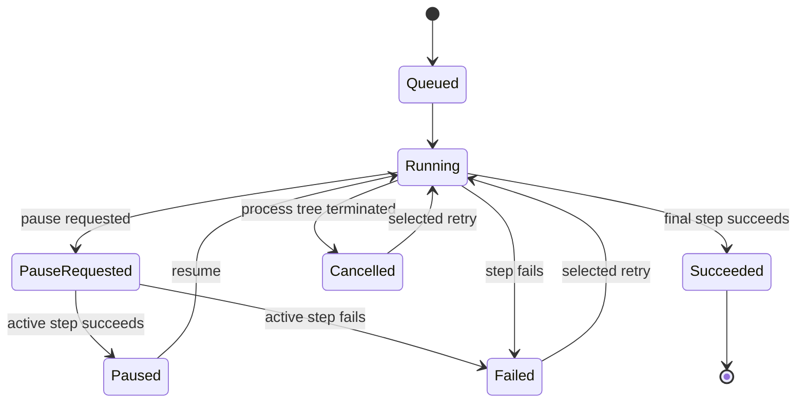
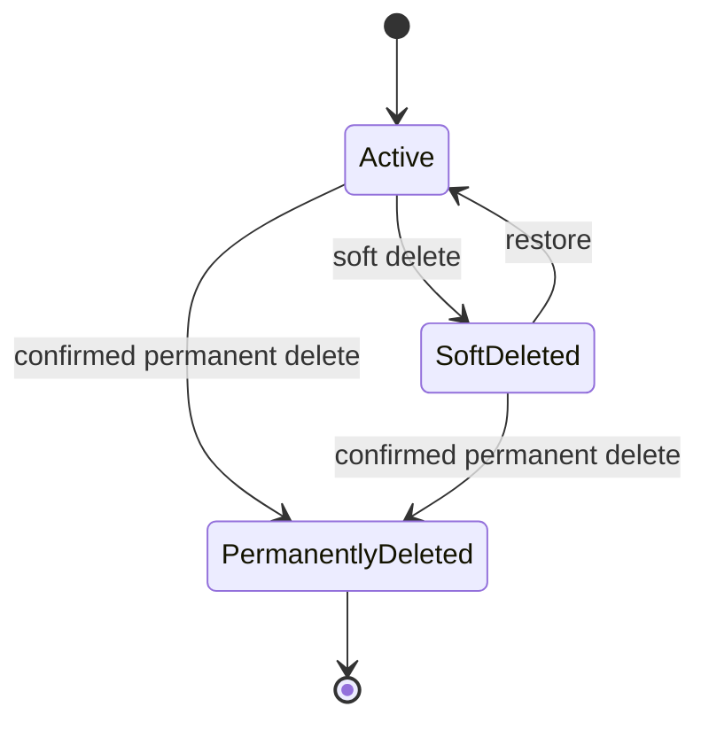
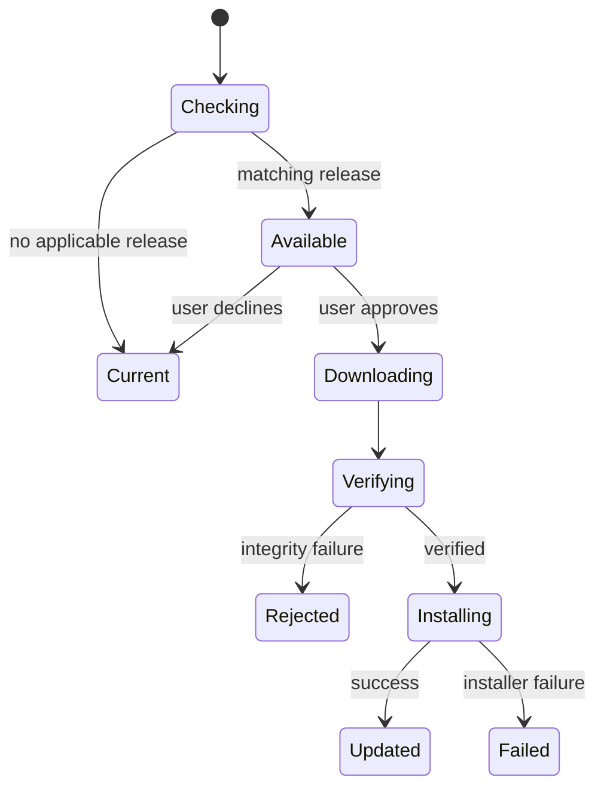

# Use Case Specification Document — Maestro

## 1. Introduction

### 1.1 Purpose

This document specifies Maestro's actor interactions, preconditions, postconditions, main flows, and resilient
alternative flows. Every Maestro entity identifier shown to an actor is the stable UUIDv7 defined in the
[System Requirements Document](System%20Requirements%20Document.md).

### 1.2 Actors

| Actor | Description |
| --- | --- |
| **User** | Authenticated owner responsible for every project, workflow, and resulting change. |
| **Operating System Authentication** | Windows Hello or Linux PAM credential verifier. |
| **AI CLI** | Claude Code, OpenAI Codex, or OpenCode executing an assigned step. |
| **Git** | Local source-control system providing status, branches, and isolated worktrees. |
| **GitHub** | Issue, pull-request, review, merge, release, and update service. |
| **Platform Installer** | Operating-system mechanism that installs a verified update. |

### 1.3 Use Case Overview

---

## 2. Use Case Specifications

---

### UC-01: Authenticate Locally

| Field | Value |
| --- | --- |
| **ID** | UC-01 |
| **Name** | Authenticate locally |
| **Actors** | User, Operating System Authentication |
| **Description** | Establishes a full-control local Maestro session. |
| **Preconditions** | Maestro is running and no protected session is active. |
| **Postconditions** | The user is authenticated or remains outside protected functions. |
| **Requirements** | FR-AU-01, FR-AU-02, FR-AU-03, FR-AU-04, FR-AU-05, FR-AU-06, FR-AU-07 |

**Main Flow**

1. The user selects operating-system or email/password authentication.
2. Maestro obtains and validates the selected credentials without logging secrets.
3. Maestro records the successful authentication audit event.
4. Maestro opens a session with full local permissions.

**Alternative Flows**

| ID | Condition | Outcome |
| --- | --- | --- |
| AF-01 | Operating-system verification fails or is unavailable. | Maestro denies access and offers email/password authentication. |
| AF-02 | A new password is shorter than eight characters. | Maestro rejects it and displays the length and strength guidance. |
| AF-03 | The normalized email already exists. | Maestro rejects account creation without revealing credential data. |
| AF-04 | Credentials are invalid. | Maestro denies access and records a redacted failed-attempt audit event. |

---

### UC-02: Register and Select a Project

| Field | Value |
| --- | --- |
| **ID** | UC-02 |
| **Name** | Register and select a project |
| **Actors** | User, Git |
| **Description** | Adds a safe reference to a local Git project and exposes it in the project panel. |
| **Preconditions** | The user is authenticated. |
| **Postconditions** | A valid unique project record is active and selectable. |
| **Requirements** | FR-PR-01, FR-PR-02, FR-PR-03, FR-PR-04, FR-PR-05 |

**Main Flow**

1. The user chooses a folder and project name.
2. Maestro confirms the folder is an accessible Git working tree.
3. Maestro validates name uniqueness and stores only metadata and the absolute reference.
4. Maestro displays and selects the project in the left panel.

**Alternative Flows**

| ID | Condition | Outcome |
| --- | --- | --- |
| AF-01 | The folder is missing, inaccessible, or not a Git working tree. | Maestro rejects registration and identifies the failed validation. |
| AF-02 | The name conflicts with an existing record. | Maestro rejects the name and asks for a unique value. |
| AF-03 | A registered folder later becomes unavailable. | Maestro preserves the record, marks it unavailable, and blocks folder-dependent actions. |

---

### UC-03: Manage a Project Record's Lifecycle

| Field | Value |
| --- | --- |
| **ID** | UC-03 |
| **Name** | Manage a project record's lifecycle |
| **Actors** | User |
| **Description** | Soft-deletes, restores, or permanently deletes Maestro metadata without touching source files. |
| **Preconditions** | The user is authenticated and the project record exists. |
| **Postconditions** | The selected metadata transition is recorded; the source folder is unchanged. |
| **Requirements** | FR-PR-06, FR-HI-07, FR-HI-08, FR-HI-09 |

**Main Flow**

1. The user chooses soft deletion, restoration, or permanent deletion.
2. Maestro shows the affected Maestro-managed records and confirms source files will remain untouched.
3. Maestro requires confirmation for permanent deletion.
4. Maestro applies the metadata transition and writes an audit event.

**Alternative Flows**

| ID | Condition | Outcome |
| --- | --- | --- |
| AF-01 | Permanent deletion is not confirmed. | Maestro makes no change. |
| AF-02 | Active runs still reference the project. | Maestro blocks permanent deletion and identifies the active runs. |
| AF-03 | The source folder is unavailable. | Maestro still permits metadata deletion without accessing the folder. |

---

### UC-04: Design a Workflow

| Field | Value |
| --- | --- |
| **ID** | UC-04 |
| **Name** | Design a workflow |
| **Actors** | User |
| **Description** | Creates or edits a reusable or one-off ordered workflow and selects its work-item approach. |
| **Preconditions** | The user is authenticated. |
| **Postconditions** | A valid workflow with a stable identifier is saved or materialized for one run. |
| **Requirements** | FR-WF-01, FR-WF-02, FR-WF-03, FR-WF-04, FR-WF-05, FR-WF-06, FR-WF-07, FR-WF-08 |

**Main Flow**

1. The user creates a reusable or one-off workflow.
2. Maestro supplies Plan, Execute, and Review in order by default.
3. The user adds, removes, names, or reorders permitted steps and selects the work-item approach.
4. Maestro validates one Execute step, ordering, and required fields.
5. Maestro assigns a stable identifier and saves the workflow.

**Alternative Flows**

| ID | Condition | Outcome |
| --- | --- | --- |
| AF-01 | Execute is missing or duplicated. | Maestro rejects save or run and identifies the invariant. |
| AF-02 | A required step value is missing. | Maestro highlights the invalid step without altering the saved revision. |
| AF-03 | A referenced project is unavailable. | Maestro permits editing but blocks execution for that project. |

---

### UC-05: Configure Step Agents

| Field | Value |
| --- | --- |
| **ID** | UC-05 |
| **Name** | Configure step agents |
| **Actors** | User, AI CLI, GitHub |
| **Description** | Assigns supported installed CLIs and available models to workflow steps. |
| **Preconditions** | A workflow with at least one step is being edited. |
| **Postconditions** | Every step has one validated CLI and model assignment. |
| **Requirements** | FR-AG-01, FR-AG-02, FR-AG-03, FR-AG-04, FR-AG-05, FR-AG-06, FR-AG-07 |

**Main Flow**

1. Maestro detects supported CLI installations and their accessible model choices.
2. The user assigns one CLI and model to each step.
3. Maestro permits repeated assignments and validates all selections.
4. Maestro saves non-secret configuration and continues to rely on each CLI's own session.

**Alternative Flows**

| ID | Condition | Outcome |
| --- | --- | --- |
| AF-01 | A CLI is missing or inaccessible. | Maestro marks the assignment unavailable and provides installation guidance. |
| AF-02 | A CLI session is unauthenticated. | Maestro blocks its step and directs the user to authenticate in the embedded terminal. |
| AF-03 | A saved model is no longer available. | Maestro requires a replacement before the workflow runs. |
| AF-04 | Model discovery fails because of network or provider failure. | Maestro retains the prior selection but marks it unverified and blocks execution until validated. |

---

### UC-06: Start Isolated Workflow Runs

| Field | Value |
| --- | --- |
| **ID** | UC-06 |
| **Name** | Start isolated workflow runs |
| **Actors** | User, Git, AI CLI, GitHub |
| **Description** | Validates and snapshots work, creates an isolated branch/worktree, and executes ordered steps. |
| **Preconditions** | The user is authenticated; project and workflow are valid; required external tools are available. |
| **Postconditions** | The run is active or ends with complete immutable execution evidence. |
| **Requirements** | FR-PR-07, FR-EX-01, FR-EX-02, FR-EX-03, FR-EX-04, FR-EX-05, FR-EX-06, FR-EX-07, FR-EX-08, FR-EX-09 |

**Main Flow**

1. The user selects a project, workflow, work item, delivery mode, and branch work type.
2. Maestro validates Git status, the work item, CLI assignments, and external readiness.
3. Maestro snapshots all run inputs and creates a typed branch in an isolated application-data worktree.
4. Maestro starts the first step and streams its output.
5. Each successful step records its outcome and passes declared context to the next step.
6. Maestro supports another isolated run concurrently and records the terminal outcome of each run.

**Alternative Flows**

| ID | Condition | Outcome |
| --- | --- | --- |
| AF-01 | The source worktree is dirty. | Maestro blocks start and asks the user to commit or explicitly discard changes before retrying validation. |
| AF-02 | The work item is missing, invalid, or inaccessible. | Maestro blocks start and asks the user to resolve it. |
| AF-03 | Branch creation or worktree isolation conflicts. | Maestro makes no source change, cleans partial run resources, and reports the Git failure. |
| AF-04 | A CLI crashes or exits unsuccessfully. | Maestro records the step failure, preserves logs, and marks the run failed. |
| AF-05 | The application closes unexpectedly. | On restart Maestro reconciles persisted state, reports interrupted processes, and offers valid recovery actions. |

---

### UC-07: Observe Active Runs

| Field | Value |
| --- | --- |
| **ID** | UC-07 |
| **Name** | Observe active runs |
| **Actors** | User, AI CLI |
| **Description** | Presents concurrent run structure, status, output, and diagnostics without impairing work. |
| **Preconditions** | At least one run exists. |
| **Postconditions** | The user sees current state and durable output for the selected run. |
| **Requirements** | FR-OB-01, FR-OB-02, FR-OB-03, FR-OB-04, FR-OB-05, FR-OB-06 |

**Main Flow**

1. The user opens the active-runs view and selects a run.
2. Maestro shows its ordered steps and highlights current status.
3. Maestro streams categorized output through bounded buffers.
4. Maestro persists output and keeps other navigation and controls responsive.

**Alternative Flows**

| ID | Condition | Outcome |
| --- | --- | --- |
| AF-01 | Output exceeds rendering capacity. | Maestro batches display updates while preserving ordered durable bytes. |
| AF-02 | Output contains undecodable bytes. | Maestro preserves raw bytes and displays a safe replacement representation. |
| AF-03 | Persistence temporarily fails. | Maestro reports degraded durability, applies bounded buffering, and fails safely before memory becomes unbounded. |

---

### UC-08: Control and Recover a Run

| Field | Value |
| --- | --- |
| **ID** | UC-08 |
| **Name** | Control and recover a run |
| **Actors** | User, AI CLI |
| **Description** | Pauses between steps, resumes, cancels, or retries a run with explicit recovery scope. |
| **Preconditions** | A controllable run exists. |
| **Postconditions** | The requested valid transition and its evidence are recorded. |
| **Requirements** | FR-RC-01, FR-RC-02, FR-RC-03, FR-RC-04, FR-RC-05, FR-RC-06, FR-RC-07, FR-RC-08 |

**Main Flow**

1. The user selects pause, resume, cancel, or retry.
2. For pause, Maestro records pause-requested, finishes the active step, and pauses before the next.
3. For resume, Maestro starts the next pending step.
4. For cancel, Maestro terminates the full run process tree immediately.
5. For retry, Maestro asks for preserved-context step, fresh affected step, or complete-workflow scope.
6. Maestro creates a new attempt and preserves all prior evidence.

**Alternative Flows**

| ID | Condition | Outcome |
| --- | --- | --- |
| AF-01 | The requested transition is invalid for the current state. | Maestro rejects it and refreshes the displayed state. |
| AF-02 | The active step fails after pause was requested. | Maestro records failure rather than paused and offers retry. |
| AF-03 | A descendant process resists termination. | Maestro escalates platform termination and reports cancellation incomplete until resolved. |
| AF-04 | Preserved context is unavailable or corrupt. | Maestro disables that retry scope and offers the remaining safe scopes. |

---

### UC-09: Use the Embedded Terminal

| Field | Value |
| --- | --- |
| **ID** | UC-09 |
| **Name** | Use the embedded terminal |
| **Actors** | User, Git |
| **Description** | Provides a full interactive platform shell rooted at the selected project. |
| **Preconditions** | The user is authenticated and the project folder is accessible. |
| **Postconditions** | The session remains interactive until exited or explicitly terminated. |
| **Requirements** | FR-TE-01, FR-TE-02, FR-TE-03, FR-TE-04, FR-TE-05 |

**Main Flow**

1. The user opens a project terminal.
2. Maestro starts the platform shell through a PTY in the project folder.
3. Maestro relays input, ANSI output, resize, selection, copy, and paste.
4. On explicit close, Maestro terminates the terminal process tree.

**Alternative Flows**

| ID | Condition | Outcome |
| --- | --- | --- |
| AF-01 | The required shell or PTY is unavailable. | Maestro does not create a partial session and shows remediation guidance. |
| AF-02 | The project folder becomes unavailable. | Maestro terminates startup or the affected session and preserves the project record. |
| AF-03 | The shell exits unexpectedly. | Maestro shows the exit result and permits a fresh session. |

---

### UC-10: Complete Supervised Delivery

| Field | Value |
| --- | --- |
| **ID** | UC-10 |
| **Name** | Complete supervised delivery |
| **Actors** | User, Git, GitHub, AI CLI |
| **Description** | Lets agents deliver a green pull request and then hands control to the user. |
| **Preconditions** | A supervised run has completed implementation. |
| **Postconditions** | A traceable pull request is open and the run awaits user action. |
| **Requirements** | FR-DE-01, FR-DE-02, FR-DE-03, FR-DE-04, FR-DE-11 |

**Main Flow**

1. The agent runs required tests and commits the change.
2. Maestro pushes the branch and opens a traceable pull request.
3. Maestro records delivery identifiers and stops the supervised run.
4. The user reviews, approves, merges, closes the work item, and deletes the branch outside agent authority.

**Alternative Flows**

| ID | Condition | Outcome |
| --- | --- | --- |
| AF-01 | Tests fail. | Maestro blocks pull-request creation and returns work to execution. |
| AF-02 | Push or pull-request creation fails. | Maestro preserves the branch and commits, records the network or authorization failure, and offers retry. |
| AF-03 | An agent attempts a prohibited action. | Maestro denies it and writes an audit event. |
| AF-04 | GitHub reports a merge conflict. | Maestro leaves resolution and final delivery with the user. |

---

### UC-11: Complete Autonomous Delivery

| Field | Value |
| --- | --- |
| **ID** | UC-11 |
| **Name** | Complete autonomous delivery |
| **Actors** | User, Git, GitHub, AI CLI |
| **Description** | Completes model-governed delivery without intermediate user intervention. |
| **Preconditions** | The user selected autonomous mode and the run completed implementation. |
| **Postconditions** | The approved green pull request is merged and delivery evidence is retained, or the run stops safely. |
| **Requirements** | FR-DE-05, FR-DE-06, FR-DE-07, FR-DE-08, FR-DE-09, FR-DE-10, FR-DE-11 |

**Main Flow**

1. The executing agent commits, tests, pushes, and opens the pull request.
2. A distinct configured review model examines the change and evidence.
3. The review model approves and all required tests pass.
4. Maestro approves and merges through GitHub, closes the applicable issue, and cleans up the branch.
5. Maestro records the review, pull request, merge commit, and audit evidence.

**Alternative Flows**

| ID | Condition | Outcome |
| --- | --- | --- |
| AF-01 | The review model requests changes. | Maestro blocks merge and returns findings to execution on the same branch. |
| AF-02 | Required tests fail or become stale after a change. | Maestro blocks merge and reruns the delivery test gate. |
| AF-03 | Review cannot run because its CLI or model is unavailable. | Maestro blocks merge and marks the run failed with recovery guidance. |
| AF-04 | GitHub rejects approval or merge because of policy, conflict, or network failure. | Maestro preserves the pull request, records the failure, and offers retry without bypassing policy. |

---

### UC-12: Inspect Run History and Audit Evidence

| Field | Value |
| --- | --- |
| **ID** | UC-12 |
| **Name** | Inspect run history and audit evidence |
| **Actors** | User |
| **Description** | Searches historical runs and inspects immutable execution and accountability evidence. |
| **Preconditions** | The user is authenticated. |
| **Postconditions** | Matching history or an empty result is displayed without changing evidence. |
| **Requirements** | FR-HI-01, FR-HI-02, FR-HI-03 |

**Main Flow**

1. The user opens history and applies search or status filters.
2. Maestro displays matching runs, including failed, cancelled, and paused entries.
3. The user selects a run.
4. Maestro displays its snapshot, attempts, logs, delivery record, and relevant audit events.

**Alternative Flows**

| ID | Condition | Outcome |
| --- | --- | --- |
| AF-01 | No history matches. | Maestro displays an empty result without treating it as an error. |
| AF-02 | A log segment is compacted. | Maestro expands it on demand before display. |
| AF-03 | A segment is corrupt. | Maestro identifies the affected segment, preserves remaining evidence, and records a diagnostic event. |

---

### UC-13: Manage Retention and Record Deletion

| Field | Value |
| --- | --- |
| **ID** | UC-13 |
| **Name** | Manage retention and record deletion |
| **Actors** | User |
| **Description** | Configures age and size policies, compacts logs, and applies reversible or permanent deletion. |
| **Preconditions** | The user is authenticated. |
| **Postconditions** | Valid settings or lifecycle changes are applied and audited. |
| **Requirements** | FR-HI-04, FR-HI-05, FR-HI-06, FR-HI-07, FR-HI-08, FR-HI-09 |

**Main Flow**

1. The user reviews or changes default retention-age and storage-size settings.
2. Maestro validates and stores the configuration.
3. Background maintenance losslessly compacts eligible log segments.
4. The user may expand a segment, soft-delete and restore a record, or confirm permanent deletion.
5. Maestro applies the action without modifying project source folders and records an audit event.

**Alternative Flows**

| ID | Condition | Outcome |
| --- | --- | --- |
| AF-01 | A configured value is invalid or unsafe. | Maestro rejects it and retains the prior configuration. |
| AF-02 | Compaction cannot reproduce the original bytes during verification. | Maestro keeps the original segment and reports the failed maintenance operation. |
| AF-03 | A record is active or required by an active run. | Maestro blocks permanent deletion until the dependency ends. |
| AF-04 | The user cancels permanent-deletion confirmation. | Maestro makes no change. |

---

### UC-14: Check and Install an Application Update

| Field | Value |
| --- | --- |
| **ID** | UC-14 |
| **Name** | Check and install an application update |
| **Actors** | User, GitHub, Platform Installer |
| **Description** | Discovers, verifies, and installs an applicable release without losing user data. |
| **Preconditions** | The user is authenticated and GitHub Releases is reachable. |
| **Postconditions** | Maestro remains unchanged or a verified update is staged and installed with a recorded result. |
| **Requirements** | FR-UP-01, FR-UP-02, FR-UP-03, FR-UP-04, FR-UP-05, FR-UP-06, FR-UP-07 |

**Main Flow**

1. A scheduled or manual non-blocking check reads the signed release manifest.
2. Maestro identifies an artifact matching the current platform, architecture, and installation type.
3. Maestro shows release notes, size, and version to the user.
4. After approval, Maestro downloads and verifies the artifact signature and checksum.
5. Maestro stages the artifact, invokes the platform installer, preserves application data, and reports result.

**Alternative Flows**

| ID | Condition | Outcome |
| --- | --- | --- |
| AF-01 | GitHub is unavailable or rate-limited. | Maestro retains the current release and schedules or permits another check. |
| AF-02 | No matching artifact exists. | Maestro explains the platform mismatch and does not download another artifact. |
| AF-03 | Signature or checksum verification fails. | Maestro deletes the staged artifact, refuses installation, and records a security audit event. |
| AF-04 | The user declines. | Maestro leaves the current installation unchanged. |
| AF-05 | Installation fails. | Maestro reports an actionable error and preserves user data and the current usable installation where the platform permits rollback. |

---

## 3. Use Case — Requirements Traceability

| Use Case | Requirements |
| --- | --- |
| UC-01: Authenticate locally | FR-AU-01, FR-AU-02, FR-AU-03, FR-AU-04, FR-AU-05, FR-AU-06, FR-AU-07 |
| UC-02: Register and select a project | FR-PR-01, FR-PR-02, FR-PR-03, FR-PR-04, FR-PR-05 |
| UC-03: Manage a project record's lifecycle | FR-PR-06, FR-HI-07, FR-HI-08, FR-HI-09 |
| UC-04: Design a workflow | FR-WF-01, FR-WF-02, FR-WF-03, FR-WF-04, FR-WF-05, FR-WF-06, FR-WF-07, FR-WF-08 |
| UC-05: Configure step agents | FR-AG-01, FR-AG-02, FR-AG-03, FR-AG-04, FR-AG-05, FR-AG-06, FR-AG-07 |
| UC-06: Start isolated workflow runs | FR-PR-07, FR-EX-01, FR-EX-02, FR-EX-03, FR-EX-04, FR-EX-05, FR-EX-06, FR-EX-07, FR-EX-08, FR-EX-09 |
| UC-07: Observe active runs | FR-OB-01, FR-OB-02, FR-OB-03, FR-OB-04, FR-OB-05, FR-OB-06 |
| UC-08: Control and recover a run | FR-RC-01, FR-RC-02, FR-RC-03, FR-RC-04, FR-RC-05, FR-RC-06, FR-RC-07, FR-RC-08 |
| UC-09: Use the embedded terminal | FR-TE-01, FR-TE-02, FR-TE-03, FR-TE-04, FR-TE-05 |
| UC-10: Complete supervised delivery | FR-DE-01, FR-DE-02, FR-DE-03, FR-DE-04, FR-DE-11 |
| UC-11: Complete autonomous delivery | FR-DE-05, FR-DE-06, FR-DE-07, FR-DE-08, FR-DE-09, FR-DE-10, FR-DE-11 |
| UC-12: Inspect run history and audit evidence | FR-HI-01, FR-HI-02, FR-HI-03 |
| UC-13: Manage retention and record deletion | FR-HI-04, FR-HI-05, FR-HI-06, FR-HI-07, FR-HI-08, FR-HI-09 |
| UC-14: Check and install an application update | FR-UP-01, FR-UP-02, FR-UP-03, FR-UP-04, FR-UP-05, FR-UP-06, FR-UP-07 |

---

## 4. State Diagrams

### 4.1 Workflow Run Lifecycle

### 4.2 Maestro Record Lifecycle

### 4.3 Application Update Lifecycle

