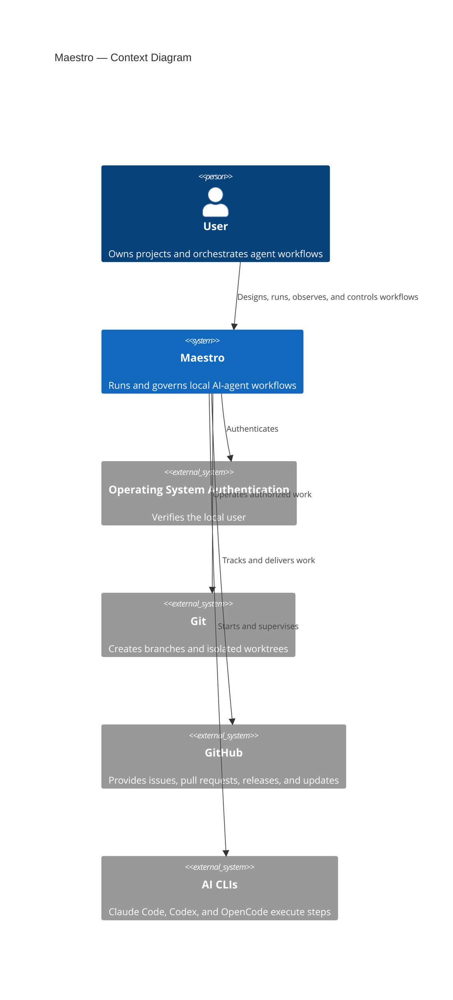
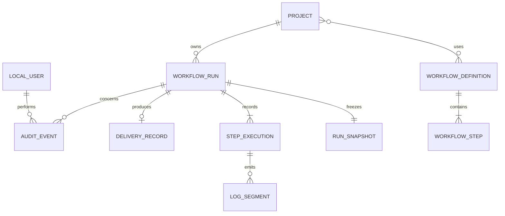
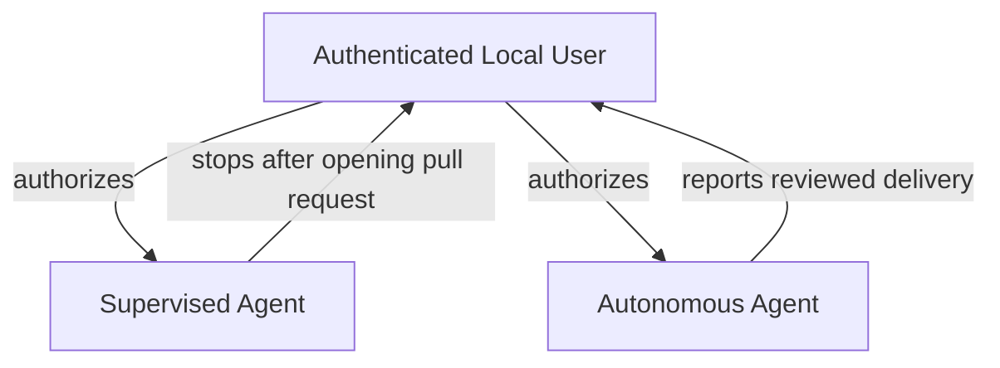

# Vision Document — Maestro

## 1. Introduction

### 1.1 Purpose

This document establishes the product vision for Maestro, a native desktop application that designs,
executes, observes, and governs AI-agent workflows against local software projects.

### 1.2 Scope

Maestro covers local authentication, project registration, reusable and one-off workflow design, AI CLI and
model assignment, concurrent background execution, live logs, embedded terminals, run control and recovery,
Git and GitHub delivery, history, auditing, data lifecycle, packaging, and application updates. The first
release does not connect to an external authentication service, although it provides a provider boundary for
one. Removing a Maestro project record never modifies its source folder.

### 1.3 Definitions and Acronyms

| Term | Definition |
| --- | --- |
| **AI CLI** | A supported command-line agent: Claude Code, OpenAI Codex, or OpenCode. |
| **Delivery mode** | Supervised or autonomous policy governing pull-request review and merge. |
| **Project** | Maestro metadata referencing a local Git project folder. |
| **PTY** | Pseudo-terminal used to provide interactive shell behavior inside Maestro. |
| **Run** | One background execution of a snapshotted workflow against a project. |
| **Run snapshot** | Immutable workflow and task configuration captured when a run starts. |
| **Step** | An ordered workflow stage assigned to an AI CLI and model. |
| **Work item** | A use case, GitHub issue, or free-form task selected for a run. |
| **Workflow** | A reusable or one-off ordered definition of agent steps. |

---

## 2. Problem Statement

Developers currently coordinate AI coding tools through separate terminals, manually transfer plans and
results between agents, watch multiple processes, manage branches, and enforce review policy themselves. This
is slow, error-prone, difficult to observe, and difficult to reproduce. Maestro centralizes that orchestration
while preserving the user's responsibility for every project and change.

---

## 3. Product Position Statement

| Attribute | Description |
| --- | --- |
| **For** | Developers who use AI agents to change local software projects. |
| **Who** | Need repeatable multi-agent workflows, live control, and traceable delivery. |
| **Maestro** | Is a native agent-workflow orchestration desktop application. |
| **That** | Runs selected AI CLIs and models through observable, recoverable workflows on isolated Git branches. |
| **Unlike** | Manual coordination across terminals, copied prompts, ad hoc scripts, and disconnected logs. |
| **Our product** | Combines reusable workflows, embedded terminals, concurrent execution, immutable history, and selectable human or model governance. |

---

## 4. Stakeholders

| Stakeholder | Role | Concern |
| --- | --- | --- |
| User | Owner and operator of Maestro, the projects, and every resulting change | Correct execution, control, safety, observability, accountability, and recoverability. |

---

## 5. High-Level Architecture

---

## 6. Core Features

| ID | Feature | Description |
| --- | --- | --- |
| F-01 | Local authentication | Authenticates through the operating system or local email and password. |
| F-02 | Project management | Registers, lists, validates, and safely removes references to local Git projects. |
| F-03 | Workflow design | Creates reusable or one-off ordered workflows with validated required steps. |
| F-04 | Agent configuration | Assigns a supported AI CLI and model to every workflow step. |
| F-05 | Concurrent execution | Runs at least two isolated workflow runs without blocking the interface. |
| F-06 | Live observation | Shows run topology, current state, streaming logs, and diagnostic status. |
| F-07 | Run control and recovery | Pauses between steps, resumes, cancels process trees, and retries at a selected scope. |
| F-08 | Embedded terminal | Provides an interactive project terminal using the platform shell. |
| F-09 | Governed delivery | Implements supervised and autonomous GitHub pull-request delivery. |
| F-10 | History and data lifecycle | Preserves snapshots, attempts, audit evidence, retention, compaction, and deletion. |
| F-11 | Application updates | Checks, verifies, downloads, and installs releases with user control. |

---

## 7. Domain Model Overview

A reusable workflow may serve many projects. A run references exactly one project and retains its own immutable
snapshot, so later edits or deletion of the source workflow cannot alter execution history.

---

## 8. Roles Hierarchy

Maestro has one authenticated application role. External agents receive authority only through the run's
selected delivery mode.

| Role | Relationship | Permissions |
| --- | --- | --- |
| **Authenticated Local User** | Sole stakeholder and accountable owner | Full control over all local Maestro data and actions. |
| **Supervised Agent** | Executes a user-authorized run | May work through pull-request creation but cannot review, approve, merge, close, or delete the branch. |
| **Autonomous Agent** | Executes a user-authorized autonomous run | May complete delivery only after passing tests and independent model approval. |

---

## 9. Constraints

- The platform and all technology decisions are defined in the
  [Technology Stack Document](Technology%20Stack%20Document.md).
- The application must run natively on supported Windows and Linux systems.
- The orchestration backend must run inside the Flutter desktop process.
- Maestro depends on locally installed and already authenticated AI CLIs.
- Execute is mandatory; Plan, Execute, and Review are the default ordered workflow.
- Project source folders remain user-owned and cannot be deleted by Maestro project-record removal.
- Autonomous merge requires successful tests and a distinct approving model review.
- No compliance, budget, or deadline constraint has been imposed.

---

## 10. Success Criteria

- Every core feature is delivered and verified on Windows and an Ubuntu LTS release.
- Claude Code, OpenAI Codex, and OpenCode each complete an end-to-end workflow.
- Supervised runs stop after pull-request creation for user review and merge.
- Autonomous runs complete only after green tests and model approval.
- At least two runs execute concurrently while the UI remains responsive.
- Current steps and logs appear as close to real time as practical without degrading execution or UI behavior.
- Paused, cancelled, failed, and retried runs preserve correct history and do not leave orphan processes.
- Deleting a project record never modifies the referenced source folder.
- Signed updates can be discovered and installed from published releases.
